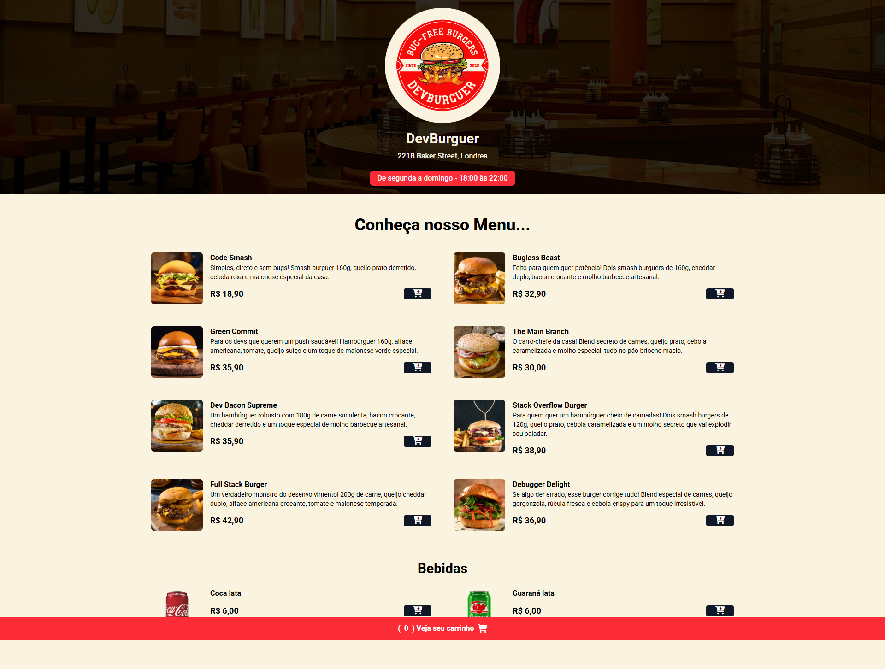

# 🍔 DevBurguer

O DevBurguer é uma aplicação web moderna e responsiva que simula o funcionamento de uma hamburgueria online, permitindo que os clientes visualizem o cardápio, adicionem itens ao carrinho e finalizem seus pedidos via WhatsApp. Desenvolvido com HTML, CSS, JavaScript puro e Tailwind CSS no front-end, e Node.js com Express no back-end, o projeto proporciona uma experiência intuitiva e eficiente.

Com funcionalidades como cálculo dinâmico do total do pedido, verificação automática do horário de funcionamento do restaurante e um fluxo simplificado para finalização via WhatsApp, o DevBurguer combina desempenho e praticidade. Sua interface moderna e otimizada garante acessibilidade em diferentes dispositivos, tornando a navegação rápida e agradável. Além disso, a implementação segura de variáveis de ambiente no servidor reforça a proteção dos dados sensíveis.

### 🔗 Acesse o projeto: [DevBurguer](https://devburguer.onrender.com/)

---

## 📸 Demonstração



---

## 📋 Funcionalidades

📜 Exibição de um cardápio com hambúrgueres e bebidas

🛒 Adicionar/remover itens do carrinho de compras

💰 Cálculo dinâmico do total do pedido

📍 Campo para inserir endereço de entrega

⏳ Verifica se o restaurante está aberto ou fechado

📲 Finaliza o pedido enviando uma mensagem automática via WhatsApp

---

## 🛠️ Tecnologias Utilizadas  

**Front-end:**  
  
  
  
  

**Back-end:**  
  
  


---

## 📁 Estrutura do Projeto
```
DevBurguer/
├── frontend/
│   ├── assets/
│   ├── styles/
│   ├── index.html
│   └── script.js
│
└── backend/
    ├── server.js
    ├── package.json
    └── package-lock.json
```
---

## ⚙️ Configuração Local

➊ Clone o repositório e acesse o diretório do back-end:
```
git clone https://github.com/alex518123/weather-app.git

cd weather-app/weather-backend
```

➋ Instale as dependências:
```
npm install
```

➌  Crie um arquivo .env na raiz do backend e adicione:
```
WHATSAPP_NUMBER=seu_numero_aqui
```

➍ Execute o servidor:
```
node index.js
```

➎  Abra o front-end utilizando um servidor local:

- Abra o arquivo index.html no diretório frontend usando um servidor local (como a extensão Live Server no VSCode).

- Isso evita problemas com requisições locais e CORS.

---

## 🔐 Segurança

Dados sensíveis como números de WhatsApp são armazenados em variáveis de ambiente.

O CORS está configurado para permitir requisições do frontend.

---

## 🤝 Contribuições

Sinta-se à vontade para abrir issues ou pull requests! Qualquer ajuda é bem-vinda. 😄

---

## 📬 Contato

📧 **E-mail:** alexresende675@gmail.com

🐙 **GitHub:** [alex518123](https://github.com/alex518123)

---

## 📄 Licença

Este projeto está licenciado sob a [MIT License](https://opensource.org/licenses/MIT).

---

Desenvolvido por: Alexander Resende [Dê uma olhada no meu portfólio!]()
